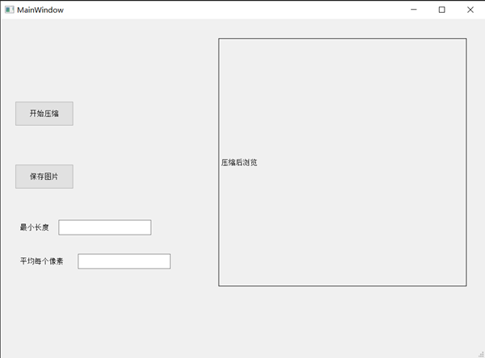
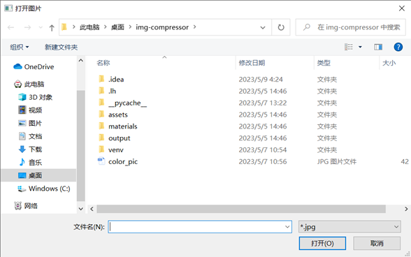
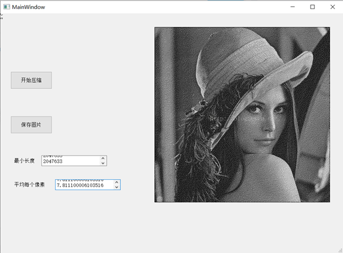
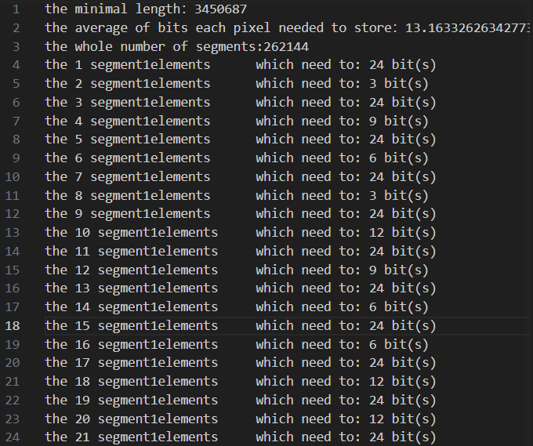

# img-compressor
use dynamic-gramming to compress images
这是一个使用动态规划将图像压缩为数组的软件，页面通过PyQt5库完成，结果以每段压缩数等展现。支持图片保存和结果txt。

### 1. 项目框架
通过`python program.py`运行本项目
项目框架：
assets/ 软件中的装饰等素材，没用
build/ 使用`pyinstaller`打包后会在源目录中生成build,dist两个文件夹和一个.spec程序
dist/ 静态程序文件夹，打包后的产物，比如这里有tmp_color.exe和pragram.exe
tmp_color.spec tmp_color程序的配置规范文件
program.spec program程序的配置规范文件
materials/ 材料
&emsp; 页面设计.png 简陋的页面设计
&emsp; 设计图2.0.png 简单的页面设计
&emsp; test_pyqt.py 线程的使用
&emsp; tmp_color.py 开始时加入了彩色图像压缩的文件
&emsp; tmp_alogrithm.py 开始时使用了动态规划的文件
result.txt 动态规划计算的结果
README.md 简单的程序须知
运行须知.md 简单的告知
更新日志.md 软件开发过程中的更新（但没怎么写就是
requirements.txt python中的依赖
dynamic_core.cpp cpp文件
dynamic_core.exe cpp进行单元测试的文件
d_core.dll cpp生成的动态链接库
program.ui PyQt库自动生成的.ui文件
program.py 主程序文件
&emsp; UI_MainWindow UI设计类
&emsp; CompressPic 压缩图片的过程-动态规划算法

### 2. 运行方式
#### 2.1 在电脑上运行program.py
step 1. 使用 `pip install -r requirements.txt`下载所有依赖
step 2. 使用`python program.py`运行主程序，稍等一会就能看到如图的界面；不响应的话多按几次回车

step 3. 点击“开始压缩”，选择图片

step 4. 查看结果
页面上的显示

结果result.txt

#### 2.2 运行exe文件
需要exe文件请联系我。软件压缩后仍有300MB，放不上来。

### 3. 其他
本项目采用mit开源协议，欢迎修改。能力有限，如有问题请多多包涵。s